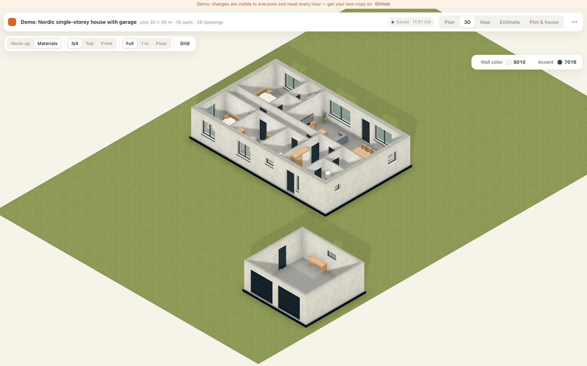
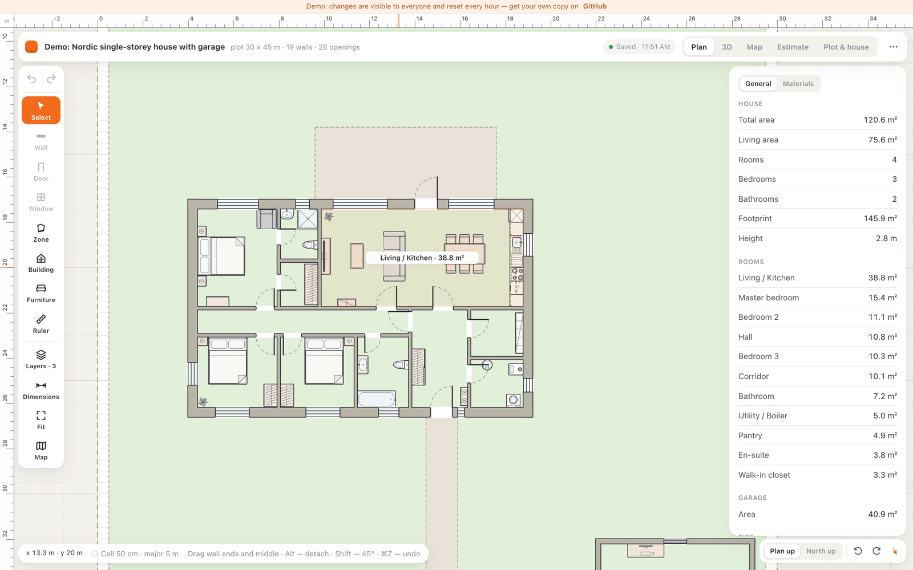
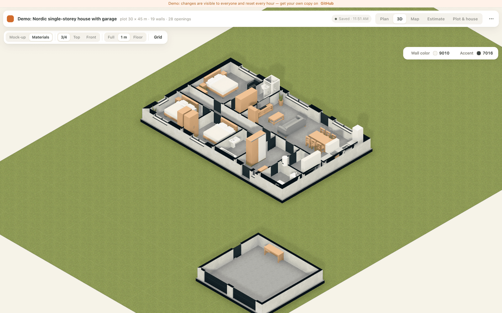
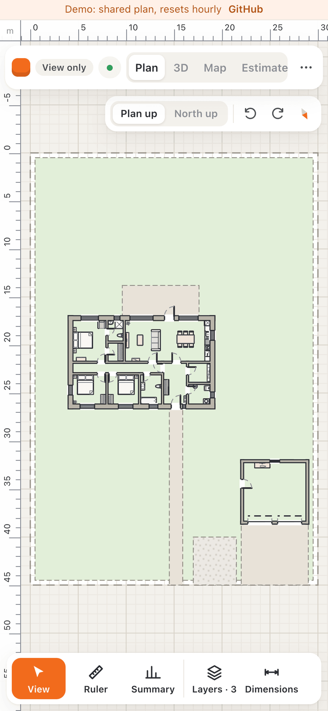
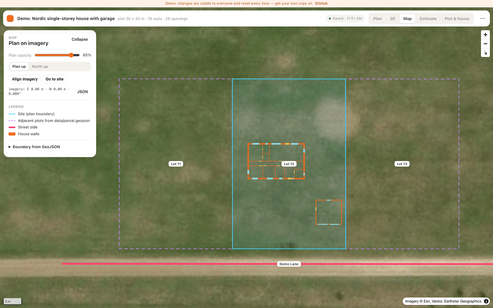
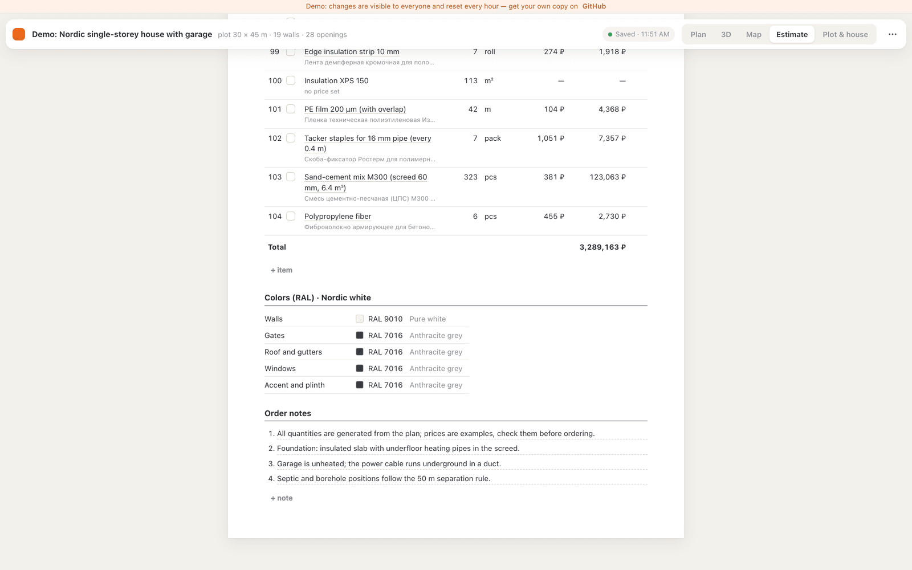
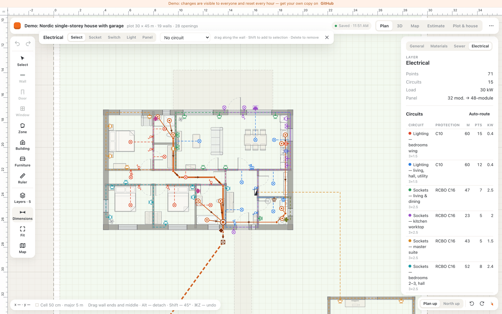
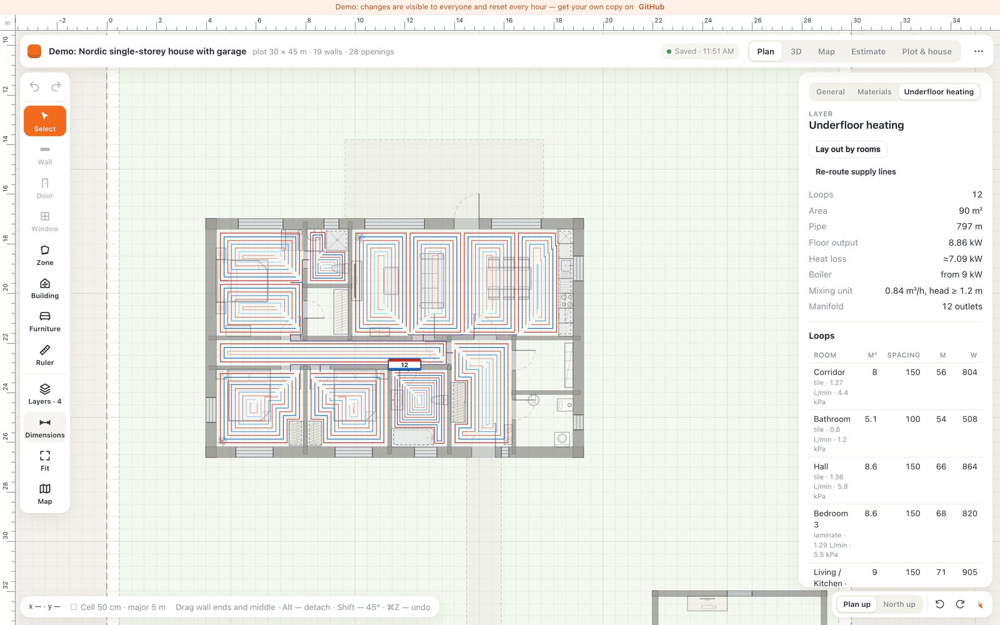
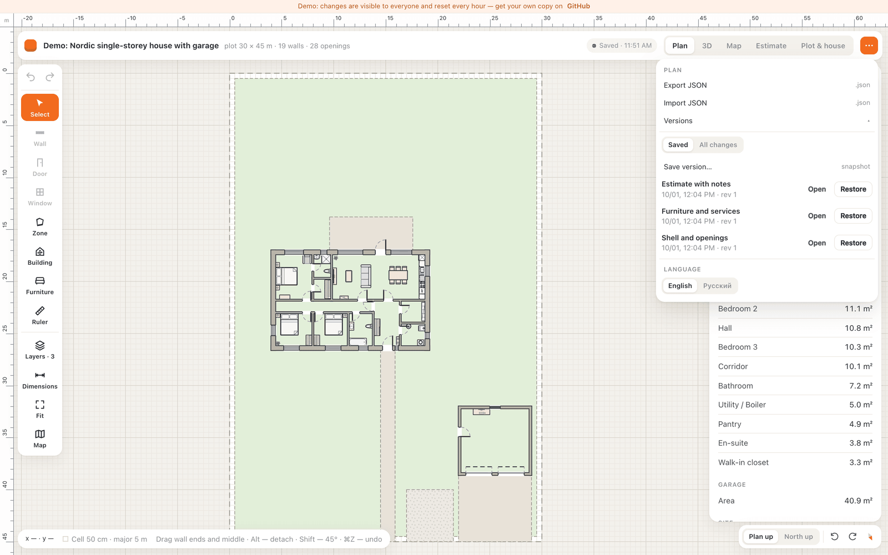

# House Planner

A self-hosted planner for a private house: true-scale 2D floor plan, 3D preview, satellite overlay, utility networks and a priced bill of materials, all stored on your own PHP hosting.

Made by the team behind [homedesignsai.pro](https://homedesignsai.pro) — an AI that helps you design your home.

[](LICENSE)
[](https://github.com/egmalt/house-planner/actions/workflows/ci.yml)
[](https://nodejs.org/)
[](https://react.dev/)
[](https://www.typescriptlang.org/)
[](https://www.php.net/)
[](docs/guide/en/install.md)
[](CONTRIBUTING.md)
[](https://app.homedesignsai.pro)

**English** | [Русский](README.ru.md)



<table>
<tr><td align="center"><br><sub>2D plan editor</sub></td><td align="center"><br><sub>3D with low walls</sub></td><td align="center" rowspan="2"><br><sub>Read-only phone view</sub></td></tr>
<tr><td align="center"><br><sub>Plan on the satellite map</sub></td><td align="center"><br><sub>Estimate on an A4 sheet</sub></td></tr>
<tr><td align="center"><br><sub>Electrical layer with circuits</sub></td><td align="center"><br><sub>Underfloor heating loops</sub></td><td align="center"><br><sub>Versions and snapshots</sub></td></tr>
</table>

**[Live demo](https://app.homedesignsai.pro)**: a shared copy without login that resets every hour, see [demo mode](docs/guide/en/demo.md). The interface is available in English and Russian.

## Features

**2D plan editor**
- Real-scale drawing in millimetres: walls with thickness and material, doors, windows, garage gates, furniture from a catalog with real dimensions, site zones (gravel fill, lawn, paving).
- Snapping to wall ends and a 100 mm grid, dimension lines, a measuring tool (`M`, chained segments), undo/redo.
- View rotation in 15° steps and "north up", building selection (`B`) to move or rotate the whole house, room labels with net area detected from the walls.
- Area summary: total and living area, rooms, bedrooms, bathrooms, building footprint, plot coverage.

**3D**
- Two looks: *Model* (clean massing) and *Materials* (textures by wall material and facade finish).
- Wall and accent colours from the RAL palette, low-wall modes (1 m and floor level) to see the layout from above, iso/top/front cameras.

**Site and map**
- Plan overlaid on satellite imagery with geo-referencing (`lat/lng` of the plan origin plus rotation).
- Site boundary from GeoJSON (for example, a cadastral parcel), neighbouring parcels from `data/parcel.geojson`, manual imagery alignment.
- Optional server-side locked site data: the legal boundary cannot be moved from the editor.

**Utility networks** (each one is a layer with its own editor, calculation and estimate group)
- **Sewer** with a septic tank: routing from fixtures, risers, cleanouts, outlets; slopes, invert levels, fittings, clearance checks.
- **Electrical**: sockets, switches, lights, panel and circuits; auto-routing along walls, cable lengths, breakers and RCDs, load and voltage-drop checks, wet-zone rules (ПУЭ, ГОСТ Р 50571).
- **Water supply**: well or borehole, pump, filter, boiler, cold/hot manifolds, home-run piping to fixtures, insulation and heating cable outside.
- **Hydronic underfloor heating**: automatic loop layout per room, edge zones, loop splitting at 80 m, heat output vs. heat loss, flow rates and balancing, manifold placement.

**Bill of materials**
- Quantities are computed from the plan and networks, prices come from a JSON catalog, an A4 print layout.
- "Bought" checkboxes with actual price and date, CSV export (Excel-friendly), one-click cart on petrovich.ru (a Russian DIY retailer).

**Storage and access**
- The plan lives on the server as JSON; every save is a numbered version, plus named snapshots you can restore.
- Optimistic concurrency (`If-Match` / `409`), so several tabs and scripts can edit safely.
- Single-password login, data files closed by an auth cookie, phones get a read-only view.

## Quick start

### Docker

```bash
git clone https://github.com/egmalt/house-planner.git
cd house-planner
docker compose up -d --build
```

Open <http://localhost:8080/> and set a password in the wizard at `/api/setup.php`. To skip the wizard, pass the password on first start: `HOUSE_PASSWORD='long-password' docker compose up -d --build`. The port is set by `HOUSE_PORT` (default `8080`). The plan, all versions and the config live in the `house-data` volume and survive rebuilds and restarts. `HOUSE_PASSWORD` is applied only to an empty storage; to change the password later, remove `config.php` from the volume (`docker compose exec house-planner rm /var/lib/house-planner/config.php`) and start again with a new `HOUSE_PASSWORD` or the wizard. Backups and HTTPS behind a reverse proxy: [installation guide](docs/guide/en/install.md#docker).

### Development mode

Requires Node.js 22 and PHP 8.1+. Two terminals:

```bash
npm i
npm run dev:api     # terminal 1: PHP API on 127.0.0.1:8000, straight from public/
```

```bash
npm run dev         # terminal 2: Vite on http://localhost:5173 with hot reload
```

Open <http://localhost:5173/api/setup.php>, set a password, then work at <http://localhost:5173/>. Vite proxies `/api`, `/data` and `/plans` to the PHP server; no build is needed. The storage is `$HOUSE_STORAGE` if set, otherwise `./storage` in the repository root (git-ignored). `scripts/dev-router.php` repeats the `.htaccess` rules for the PHP built-in server; it is for your own machine only.

More details: [installation guide](docs/guide/en/install.md).

## Self-hosting

Any shared hosting with **PHP 8.1+** (with the `curl` extension for the Petrovich cart) and **Apache or LiteSpeed** with `mod_rewrite` works. No database, no Node.js on the server.

1. **Build** locally: `npm ci && npm run build`. The result is the static `dist/` folder with the PHP API in `dist/api/`.
2. **Upload** the contents of `dist/` to the site root: via `scripts/deploy.sh` (rsync over SSH or FTP mirror, settings in `.env.deploy`, see [`.env.deploy.example`](.env.deploy.example)) or any FTP client.
3. **Run the wizard**: open `https://your-site/api/setup.php` once. It picks a storage location, asks for a password (8+ characters), writes `storage/config.php` with the password hash and a random cookie token, and closes `data/` and `plans/` behind that cookie. After that the wizard returns `403`. Set the `HOUSE_SETUP_KEY` environment variable if you want the wizard to require an extra key.
4. **Storage** is looked up in this order: `$HOUSE_STORAGE`, `<site root>/../storage` (outside the web root, preferred), `<site root>/storage` (inside, denied by `.htaccess`). It holds `config.php`, `current.json`, every version in `versions/`, and snapshots in `snapshots/`.
5. **HTTPS**: enable it on the hosting (Let's Encrypt is usually one click). The login cookie is `HttpOnly`, `SameSite=Lax` and gets `Secure` automatically on HTTPS.

On nginx without Apache, `.htaccess` is ignored: deny `/storage`, `/data` and `/plans` in the server config yourself. Step-by-step instructions, updates and backups: [deployment guide](docs/guide/en/deploy.md).

## Plan format

A plan is one JSON document in integer millimetres: `site` (size, boundary, geo-reference, zones), `materials`, `walls` (axis line `a → b`, thickness, height, material), `openings` (doors, windows, gates by offset along a wall), `furniture`, `rooms`, `estimate` and `networks` (`sewer`, `electric`, `water`, `heating`). The zod schema in [`src/model/schema.ts`](src/model/schema.ts) is the source of truth; `npm run plan:validate` checks the demo plan with it.

Full description (in Russian): [docs/plan-format.md](docs/plan-format.md). HTTP API: [docs/api.md](docs/api.md).

## Working with an AI assistant

Because the plan is plain JSON with a strict schema, any LLM assistant can edit it: "add a 5 m wall from the house corner to the east", "put a 1200 mm window in the middle of wall w2", "route the bathroom sink to the riser". The loop is:

```bash
scripts/plan-pull.sh                    # server → plans/server.json
# edit plans/server.json by hand or with an assistant
node scripts/plan-validate.mts plans/server.json
scripts/plan-push.sh                    # → new version on the server
```

`plan-push.sh` uses the same versioned API as the browser: if the plan changed meanwhile, it saves the server copy as `*.conflict.json` and exits with code `2` instead of overwriting. Open tabs pick up the new version automatically. Guide with prompts and pitfalls: [editing the plan via JSON](docs/guide/en/plan-via-chat.md).

## Tech stack

React 19, TypeScript, Vite, Zustand + zundo (undo), zod, Konva / react-konva (2D), three.js with React Three Fiber, drei and postprocessing (3D), three-bvh-csg (openings), clipper2 (polygon offsets), MapLibre GL and proj4 (map), plain PHP for the API with file storage and `flock`.

## Roadmap

- Roof: shapes, slopes, rafters and roofing materials in 3D and in the estimate.
- Foundation: slab, strip and pile foundations with volumes and rebar.
- Water supply hydraulics: pressure and head calculation, pump selection.
- Export to PDF and DXF.
- More interface languages: English and Russian today, translations are welcome.

## Disclaimers

- **Prices** in `public/data/catalog.json` are an example collected from stores in Saint Petersburg, Russia, on the date in each item's `checkedAt`. They are not an offer and will go stale; replace them with your own.
- **Building codes** (СП, ПУЭ, СанПиН, ГОСТ) are used as reference checks only. The calculations do not replace a design by a licensed engineer.
- The demo plan is a fictional Nordic single-storey house with a garage on a 30 × 45 m plot in Estonia.

## FAQ

Hosting, passwords, backups, updates, your own plot, the catalog, mobile, offline use: see the [FAQ](docs/guide/en/faq.md). Day-to-day editor usage: [usage guide](docs/guide/en/usage.md).

## Contributing

Issues and pull requests are welcome. Read [CONTRIBUTING.md](CONTRIBUTING.md) first; by participating you agree to the [Code of Conduct](CODE_OF_CONDUCT.md). Security issues: [SECURITY.md](SECURITY.md). Changes: [CHANGELOG.md](CHANGELOG.md).

## Credits

House Planner is built and maintained by the team behind [homedesignsai.pro](https://homedesignsai.pro). Contact: [hello@homedesignsai.pro](mailto:hello@homedesignsai.pro).

## License

[MIT](LICENSE). Third-party textures and furniture models keep their own licenses, see `public/textures/LICENSE.txt` and `public/models/furniture/LICENSES.md`.
